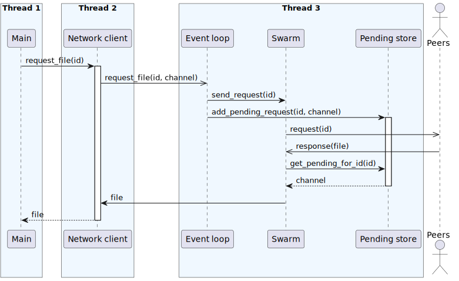

# libp2p-invert

An inversion of control procedural macro layer over [rust-libp2p](https://github.com/libp2p/rust-libp2p)

> [!NOTE]
> This library will be moved outside of the EON workspace after passing all
> the requirements.

## Usage
### Creating a network client
Create a network client structure using the `swarm_client` macro.
Pass your `NetworkBehaviour` as an argument.

```rust
#[swarm_client(Behaviour)]
#[derive(Clone)]
pub(crate) struct Client {
    keys: identity::Keypair,
}
```

You can put whatever you want in this structure.

### Implementing handlers
Create an `impl` block for your client structure:
```rust
#[event_subscriber(Behaviour)]
impl Client {
    // Your code goes here
}
```

The `event_subscriber` attribute gives you access to:
- The `register` function which gives you direct access to `Swarm`
- The `subscribe!` pseudomacro that allows you to await a given swarm event

Let's see it in action:

```rust
/// Find the providers for the given file on the DHT.
pub(crate) async fn get_providers(
    &self,
    object: ObjectId,
) -> Result<HashSet<PeerId>, Box<dyn Error + Send + Sync>> {
    let query_id = self
        .register(move |swarm| {
            swarm
                .behaviour_mut()
                .kademlia
                .get_providers(Vec::from(object).into())
        })
        .await?;

    let providers =
        subscribe!(query_id: QueryId => SwarmEvent::Behaviour(BehaviourEvent::Kademlia(
            kad::Event::OutboundQueryProgressed {
                #[key] id,
                result:
                    kad::QueryResult::GetProviders(Ok(kad::GetProvidersOk::FoundProviders {
                        providers,
                        ..
                    })),
                ..
            }
        )))
        .await?;

    Ok(providers)
}
```

### The subscribe! pseudomacro
This pseudomacro comes in two flavors:

#### Match every event occurance
This is useful for handling events that aren't
associated with any specific peer or request. For example:
```rust
let _ = subscribe!(_ => SwarmEvent::Behaviour(BehaviourEvent::Kademlia(
    kad::Event::OutboundQueryProgressed {
        result: kad::QueryResult::Bootstrap(Ok(_)),
        ..
    }
)))
.await?;
```
This example will await every successful bootstrap event. It returns the `result`.
However - we decided to ignore it.

#### Match by key
Match events related to a corresponding request key. For example:

```rust
let out = subscribe!(id: PeerId => SwarmEvent::ConnectionEstablished {
    #[key] peer_id,
    endpoint,
    ..
})
.await?;
```

This example will await a `ConnectionEstablished` event for a given peer. This
time we return the `endpoint` for use later as the `out` variable.

### The subscribe! event argument
Each swarm produces events in form of a very large `SwarmEvent`. The `subscribe!`
macro expects an event arm to match against. During compilation every `subscribe!`
invocation gets accumulated by the `event_subscriber` macro, which combines all
of the scattered match arms into a single event handler state machine.


## The problem it's trying to solve
### The design of rust-libp2p
The rust-libp2p library exposes a state machine interface to the whole peer swarm.
Here's a sequence diagram for its recommended usage according to the [official file sharing example](https://github.com/libp2p/rust-libp2p/tree/master/examples/file-sharing):



It's expected that libp2p's end users write a network client that converts
asynchronous function calls into awaitable futures.

> [!Note]
> rust-libp2p was designed before Rust's async support was standardized. As such,
> its state machine API doesn't expose any awaitable futures, even though
> the swarm itself runs asynchronously.

The main way to do that is through channels. The idea is simple:
1. The network client actor sends a oneshot channel to the event loop actor.
2. The network client awaits a response from the channel
3. The event loop sends a response when the request gets completed

In order to implement this one also needs to manually write the event loop actor
and the pending request storage.

### End-user issues
The procedure above while simple in theory is extremely fragile to implement:
- Since both the network client and event loop are actors, communication between
them is encoded in a message enum. Each additional function requires extending
that enum and adding another arm to a corresponding handler match statement
- Each type of request needs a different variable inside the store, which also
needs to be added manually
- Each oneshot channel needs to be set up manually
- Each oneshot channel needs to be retrieved manually
- Everything done inside the event loop thread is a mix of asynchronous
(in the traditional POSIX/C-style sense) and synchronous function calls

> [!WARNING]
> Since the end users are forced to write an event loop by themselves what
> happens in real life is that some processes don't exit that loop. That is -
> there exists a mix of logic handled outside that loop with the network 
> manager and logic handled directly within the event loop itself. This makes
> everything much harder to reason about.

### What this library actually does
This library provides a macro that automatically generates the network client
along with all the structures and actors that need to support it. In particular
- it also generates the whole event loop for you. The end users of this library
don't see any state-machine and async channel related code at all.
